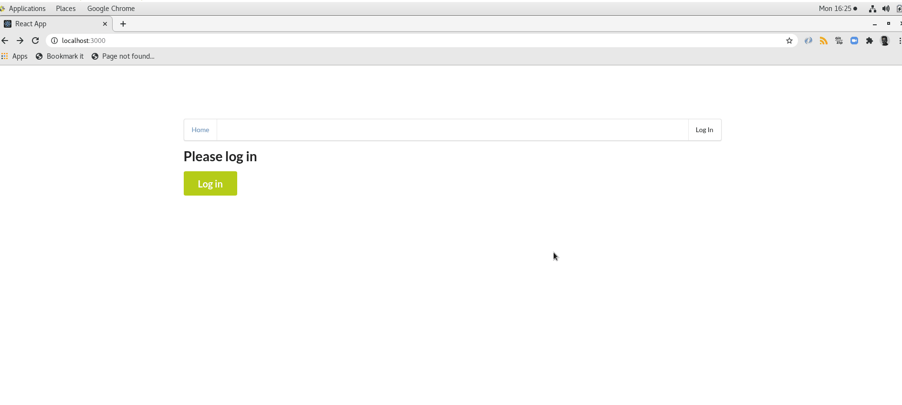

# Serverless Bookshelf

This project is done as the Capstone Project of Cloud Developer Nanodegree. The goal of this project to implement a simple Bookshelf application using AWS Lambda and Serverless framework.



## Functionality of the application

This application allows to create/remove/update/fetch books into a user's bookshelf. Each book item can optionally have an attachment image. Each user only has access to book items that he/she has created.

## Book Item

The application stores Book items, and each Book item contains the following fields:

* `bookId` (string) - a unique id for a book
* `userId` (string) - the user id that created this book item
* `createdAt` (string) - date and time when a book was added to the bookshelf
* `title` (string) - title of the book (e.g. "How Innovation Works")
* `author` (string) - author of the book (e.g. "Matt Ridley")
* `description` (string) - description of the book
* `read` (boolean) - a flag indicating whether the book has been read or not
* `rating` (number) - a user's rating of the book, default 0, allowed values 1-5
* `attachmentUrl` (string) (optional) - a URL pointing to an image attached to a Book item


## Functions implemented

To implement this project, the following functions have been configured: 

* `Auth` - this function implements a custom authorizer for API Gateway that is attached to all other functions.

* `GetBooks` - returns all books added to the bookshelf for a current user. A user id is extracted from a JWT token that is sent by the frontend

It returns data that looks like this:

```json
{
    "items": [
        {
            "read": true,
            "bookId": "94eca36a-dc94-4d36-a465-8b55fb60b1e3",
            "rating": 5,
            "attachmentUrl": "https://serverless-bookshelf-nitin-ab123de-attachments-dev.s3.amazonaws.com/94eca36a-dc94-4d36-a465-8b55fb60b1e3",
            "userId": "realnitinworks@gmail.com",
            "createdAt": "2021-01-04T06:28:07.742Z",
            "description": "A book that can change the course of your life",
            "author": "Dale Carnegie",
            "title": "How to stop worrying and start living"
        },
        {
            "read": true,
            "bookId": "92feb3f8-5f18-4492-9efe-a27a24accab9",
            "rating": 3,
            "attachmentUrl": "https://serverless-bookshelf-nitin-ab123de-attachments-dev.s3.amazonaws.com/92feb3f8-5f18-4492-9efe-a27a24accab9",
            "userId": "realnitinworks@gmail.com",
            "createdAt": "2021-01-04T06:26:06.194Z",
            "description": "Innovation flourishes in freedom",
            "author": "Matt Ridley",
            "title": "How Innovation Works"
        }
    ]
}
```

The book items are sorted by the createdAt attribute in descending order.

* `CreateBook` - create/adds a new Book into the current user's bookshelf. A shape of data send by a client application to this function can be found in the `CreateBookRequest.ts` file

It receives a new Book item to be created in JSON format that looks like this:

```json
{
    "title": "How to stop worrying and start living",
    "description": "A book that can change the course of your life",
    "author": "Dale Carnegie"
}
```

It returns a new Book item that looks like this:

```json
{
    "item": {
        "userId": "realnitinworks@gmail.com",
        "bookId": "c13a26c4-2604-4493-8176-3b445394b47b",
        "createdAt": "2021-01-04T07:26:01.320Z",
        "title": "How to stop worrying and start living",
        "author": "Dale Carnegie",
        "description": "A book that can change the course of your life",
        "read": false,
        "rating": 0
    }
}
```

* `UpdateBook` - updates a Book item created by a current user. A shape of data send by a client application to this function can be found in the `UpdateBookRequest.ts` file

It receives an object that contains five fields that can be updated in a book item:

```json
{
    "title": "How Innovation Works",
    "author": "Matt Ridley",
    "description": "A new description",
    "read": true,
    "rating": 2,
}
```

The id of an item that has to be updated is passed as a URL parameter.

It returns an empty body.

* `DeleteBook` - deletes a Book from the bookshelf of the current user. Expects an id of a book item to remove.

It returns an empty body.

* `GenerateUploadUrl` - returns a pre-signed URL that can be used to upload an attachment file for a Book item.

It returns a JSON object that looks like this:

```json
{
  "uploadUrl": "https://s3-bucket-name.s3.ap-south-1.amazonaws.com/image.png"
}
```

All functions are already connected to appropriate events from API Gateway.

An id of a user can be extracted from a JWT token passed by a client.

The `serverless.yml` file includes all of these functions as well as a DynamoDB table and a S3 bucket in the `resources`.


## Authentication

This app is using Auth0 to implement authentication. The configuration of the "domain" and "client id" are available on the `client/src/config.ts` file.


## How to run the application

### Prerequisite

1. Install serverless `npm install -g serverless`

2. Set up a new user in IAM named "serverless" with Programmatic access and with AdministratorAccess policy attached and save the access key and secret key.

3. Configure serverless to use the AWS credentials you just set up:
`sls config credentials --provider aws --key YOUR_ACCESS_KEY --secret YOUR_SECRET_KEY --profile serverless`

### Backend

To deploy this application, use the following commands: `sls deploy -v`


### Frontend

To have the application running on your local machine, run the following commands:

```
cd client
npm install
npm run start
```

## Screenshots

### Authentication

- Auth0 integration into the Bookshelf application


- Login into the Bookshelf application through Auth0


### Resource Creation

- DynamoDB to store Book item with userId, bookId, createdAt, title, author, description and other attributes


- s3 Bucket to store book cover image attached to Book item


### Lambda Functions


### Observability

- CloudWatch to monitors logs


- X-Ray to record metrics


